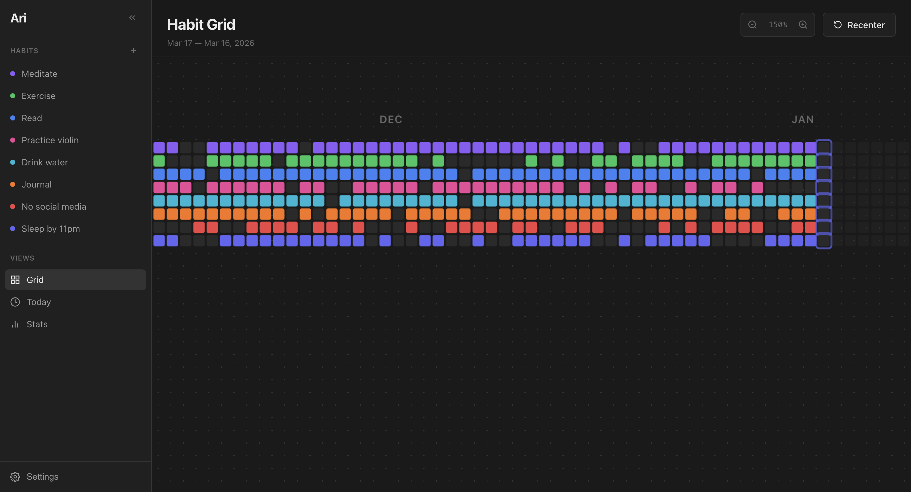
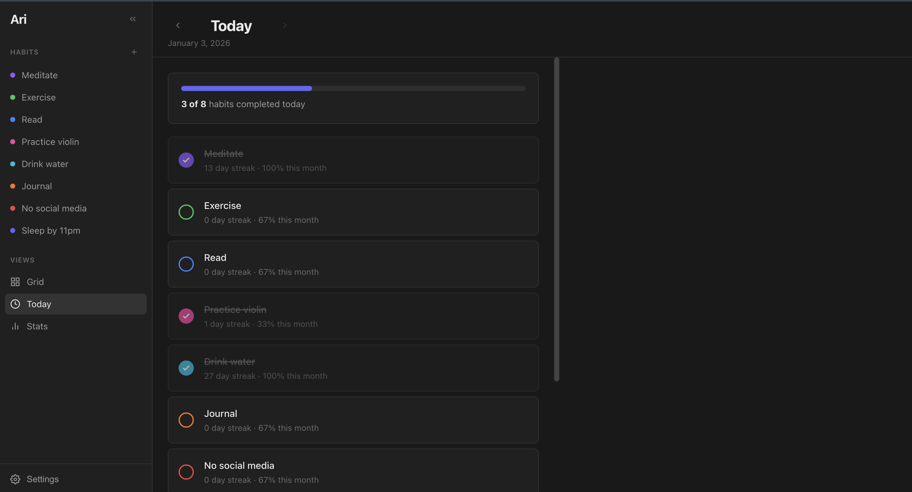
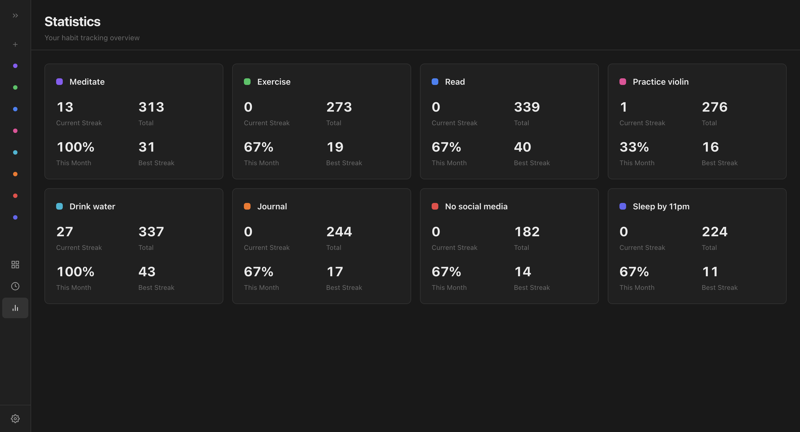

# Ari

I wanted to create minimalist habit tracker with an infinite canvas interface that I would actually use. Rather than focusing on different features, I wanted some lightweight but visually appealing. Mostly a project for myself but happy to scale this and add some features that are actually helpful or necessary. 



| Today View | Statistics View |
|-----------|------------| 
|  |  |


## Installation

### macOS

1. Go to the [Actions tab](https://github.com/psjesusangel/ari/actions) and select the latest successful workflow run
2. Download the macOS build artifact
3. Unzip and drag Ari to your **Applications** folder
    - Note: opening from downloads will not work since Apple will make you trash it 
4. **First launch:** macOS will block the app since it's unsigned (not trying to pay for all that):
   - Open **System Settings → Privacy & Security**
   - Scroll down and click **"Open Anyway"** next to the Ari message
   - Or: Right-click Ari in Applications → Open 

### Building from Source

Prerequisites: [Node.js](https://nodejs.org/) (v18+), [Rust](https://rustup.rs/)

```bash
git clone https://github.com/psjesusangel/ari.git
cd ari
npm install
npm run tauri dev
```

## Updating

Download the latest build from GitHub Actions and replace the app in your Applications folder. Your habit data is stored separately and will be preserved. If I end up working on this more, I'll find a more convenient way of doing this.


## License

MIT
